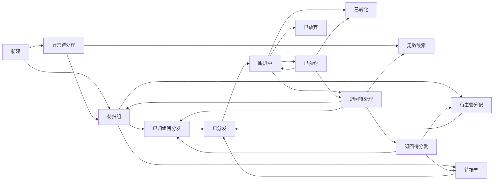

# 线索管理系统 PRD（原型设计版）

## 1. 文档信息

- 文档名称：线索管理系统 PRD（原型设计版）
- 文档用途：用于产品原型设计、页面信息架构梳理、交互说明统一
- 适用阶段：MVP + 近期迭代规划
- 输出对象：产品、UI/UX、前端、后端、测试

## 2. 文档目标

当前已有需求文档已经明确了产品方向和功能边界，但还不够支撑原型设计。本文档在不扩大范围的前提下，补齐以下内容：

- 角色与权限边界
- 业务流程与状态流转
- 页面结构与导航关系
- 关键页面的模块、字段、按钮、交互
- 异常态、空状态、校验规则
- 原型设计优先级

本文档默认以当前共识边界为准：

- 首期围绕 `线索收集 -> 进入公海 -> 异常处理 -> 归组分发 -> 跟进 -> 基础报表`
- 支持 `PC 管理端 + 一个移动端小程序 + 用户提交表单`
- `广告 API 对接` 明确放在最后阶段，不纳入当前原型主范围

## 3. 产品概述

### 3.1 产品定位

面向中小型企业，提供一套轻量、易用、低成本的线索全生命周期管理系统，帮助企业统一管理线索来源、提高分发效率、规范跟进行为并形成数据复盘能力。

### 3.2 产品目标

- 提升线索录入与流转效率
- 降低线索遗漏和重复分发
- 提升员工跟进规范性
- 帮助管理者追踪来源、人员效率和转化结果

### 3.3 当前版本范围

本版本覆盖：

- 员工手工录入线索
- Excel 导入线索
- URL/H5 收集表单
- 线索公海管理
- 系统自动校验与异常标记
- 重复 / 无效 / 信息不完整线索处理
- 线索分发规则组管理
- 线索归组
- 手动分发
- 轮循自动分发
- 规则组抢单模式
- 跟进记录
- 线索状态管理
- 员工管理
- 部门管理
- 组管理
- 基础角色权限
- 基础报表
- 移动端员工跟进
- 用户端线索提交

本版本不覆盖：

- 广告 API 对接
- 加权分发
- 条件分发
- 转介绍
- 积分 / 奖励系统
- 复杂审批配置
- CRM / 会员系统深度对接
- 高级自定义报表

## 4. 用户角色与权限边界

### 4.1 角色定义

#### 超级管理员

- 管理企业基础设置
- 管理组织、角色、权限
- 查看所有线索和报表
- 配置字段、分发规则、消息提醒

#### 普通管理员 / 销售经理

- 处理异常线索
- 管理线索分发规则组
- 对规则组内线索发起分发
- 查看所属范围内线索和部门 / 组数据
- 查看退回线索、放弃线索

#### 组织管理员 / 人事管理员

- 新增员工
- 编辑员工资料
- 赋予员工角色
- 管理部门
- 管理组
- 调整组织归属
- 停用账号
- 办理离职与线索移交

#### 销售 / 跟进员工

- 查看分配给自己的线索
- 新增跟进记录
- 修改可编辑状态
- 退回线索
- 查看个人数据
- 手工录入线索

#### 市场人员

- 查看来源维度数据
- 查看导入结果
- 管理表单投放信息
- 当前阶段不包含广告 API 配置页

#### 普通用户

- 提交线索表单
- 查看提交成功结果页

### 4.2 权限原则

- 员工只能查看自己负责的线索
- 经理默认查看本组或本部门线索
- 管理员可查看全量线索
- 异常处理、分发、权限配置仅管理角色可操作
- 跟进记录新增后不可物理删除，只允许追加

## 5. 核心业务流程

### 5.1 主流程

1. 线索进入系统
2. 系统自动做去重、完整性和风险校验
3. 线索直接进入公海
4. 正常线索进入 `待归组`，异常线索进入 `异常待处理`
5. 系统自动归入对应分发规则组，或管理员手动归组
6. 规则组内线索根据分发方式进入 `待分发`、`待主管分配` 或 `待抢单`
7. 管理员在规则组内按规则执行手动分发、轮循分发或抢单分发
8. 若规则组的 `分发对象类型 = 主管`，则第一段可由多个主管参与手动、轮循或抢单；单条线索一旦分配给某个主管，再由该主管在其授权团队内手动二次分配给员工
9. 员工跟进并记录过程
10. 线索进入已预约 / 已转化 / 已放弃等状态
11. 管理员通过报表进行复盘

### 5.2 线索来源

- 员工手工录入
- Excel 批量导入
- URL/H5 表单提交

### 5.3 特殊流程

#### 重复线索处理

- 命中重复规则后，线索直接进入公海，并标记为 `异常待处理-重复`
- 管理员可选择 `合并`、`保留新线索并继续流转`、`标记无效`

#### 退回流程

- 员工对无法继续跟进的线索发起退回
- 填写退回原因后提交
- 管理员处理退回结果
- 处理完成后线索重新进入 `待归组` 或 `已归组待分发`

#### 放弃流程

- 员工选择放弃线索时必须填写原因
- 放弃后状态变为 `已放弃`
- 管理员可查看放弃明细用于复盘

#### 员工移动端自录线索流程

- 员工可在小程序端手工新增线索，适用于地推、门店接待、电话回呼等移动场景
- 员工本人录入的线索是否进入公海或直接归属本人，由员工属性中的 `录入归属策略` 控制，不在文案层写死
- 系统仍需执行去重、完整性和风险校验
- 若命中重复或信息缺失等异常规则，线索仍先创建成功，但状态标记为 `异常待处理`，并通知管理员处理
- 异常处理完成前，该线索归属人仍显示为录入员工本人，但限制继续推进关键状态
- 未命中异常规则时，若员工属性配置为 `self_follow`，线索直接进入员工的 `我的线索` 待跟进列表；若配置为 `public_pool`，则先进入公海再按规则流转
- 管理员可对员工自录线索执行转交、回收到公海或纳入规则组分发，但必须记录原因

#### 官网前台 H5 表单提交流程

- 企业可在 `渠道设置` 中为不同站点创建多个前台 H5 表单
- 表单字段从系统已有字段中选择，不在前台 H5 表单模块内单独新建业务字段体系
- 系统为每个表单生成可嵌入官网、活动页或落地页的 JS 代码
- 用户提交后，数据实时回传系统，先写入 `表单提交记录`，再自动生成线索
- 线索来源统一写入 `官网 - 表单`
- 系统同时记录站点、表单、提交页面 URL、访问设备、IP、城市、停留时长和浏览轨迹摘要等渠道追踪信息
- 系统对提交数据自动执行：
  - 必填校验
  - 防刷校验
  - 手机号格式化
  - 去首尾空格
  - 去重、完整性和风险校验
- 未命中异常规则时，线索进入现有公海、归组和分发链路
- 命中重复、信息不完整或风险规则时，线索进入 `异常待处理`
- 不同站点、不同表单的提交数据需支持分别统计、分别筛选和分别追溯

#### 规则组归集流程

- 正常线索进入公海后先进入 `待归组`
- 系统先校验入组前置门槛，仅正常线索、异常处理后允许继续流转的线索、管理员重新投入分发链路的线索参与入组判断
- 系统根据规则组条件自动匹配线索
- 命中多个规则组时，按优先级进入优先级最高的规则组
- 若多个规则组优先级相同，则按规则组创建时间更早者生效
- 未命中任何规则组时，进入 `未归组队列`
- 企业可按业务需要配置一个低优先级通用承接规则组，当普通规则均未命中时自动进入该规则组
- 管理员可手动调整线索所属规则组
- 未命中任何规则组的线索，支持有权限的管理员手动归组
- 手动归组后，线索进入目标规则组，并继续遵循目标规则组的分发对象与分发规则
- 手动归组必须记录操作人、归组原因、目标规则组和操作时间
- 仅进入规则组的线索，才允许在组内发起分发

#### 分发执行模型

- 线索进入规则组后，不立即等同于完成分发
- 规则组需先定义 `分发对象类型`，再定义 `分发规则`
- `分发对象类型` 只有两种：
  - 直接员工：线索直接分给员工，员工为最终持有人
  - 主管：线索先分给主管，进入主管所在团队的待分配池，再由主管手动分给团队成员
- `分发规则` 只有三种：
  - 手动
  - 轮循
  - 抢单
- 三种分发规则本质上都是“如何把线索分给已选分发对象”
- 分发对象是员工时，三种规则作用于员工分发范围
- 分发对象是主管时，三种规则作用于主管分发范围
- 若分发对象是主管，则主管收到线索后，仅允许手动二次分配给团队成员
- 线索最终进入员工名下，员工才是线索最终持有人
- 分发对象选择时，必须按部门展示，便于识别组织归属

#### 分发触发规则

- 规则组除命中条件外，还需配置分发触发规则
- 分发触发规则包括：
  - 分发时间段
  - 进入组后多少分钟开始分发
- 线索进入规则组后，系统记录进入组时间
- 只有在达到等待时长且当前处于允许分发时间段时，系统才执行分发
- 若等待时长已到但当前不在允许分发时间段，则顺延至下一个允许分发时间段执行

#### 抢单流程

- 抢单模式不直接作用于整个公海，而是作用于某个规则组内的线索
- 当规则组分发规则设置为 `抢单` 时，归入该组的线索进入 `待抢单`
- 若分发对象为员工，则员工分发范围内员工可见并抢单
- 若分发对象为主管，则主管分发范围内主管可见并抢单
- 只有后台已开启抢单模式，且当前人员属于可抢范围时，才展示抢单入口
- 抢单遵循先到先得，系统在抢单瞬间加锁，避免多人同时抢成功
- 若抢单对象为员工，抢单成功后线索进入员工名下
- 若抢单对象为主管，抢单成功后线索进入 `待主管分配`
- 若在设定时效内无人抢单，线索按规则自动转入轮循分发
- 员工退回后的线索默认不立即回到原员工可重复抢的状态，需先经过经理或系统重新投入抢单池

#### 主管承接流程

- 当规则组的分发对象类型为 `主管` 时，线索先分给主管
- 第一段分发对象不是普通员工，而是规则组配置的主管分发范围
- 主管分发范围可按部门负责人、组长、指定经理角色进行配置
- 第一段可配置多个主管共同参与手动、轮循或抢单
- 主管接收线索后，线索进入 `待主管分配`
- 主管需在自己的待分配队列中手动二次分配给团队成员
- 单条线索分配给某个主管后，该主管仅允许分配给自己授权团队内员工
- 二次分配完成前，线索不进入普通员工的 `我的线索`
- 二次分配完成后，线索状态切换为 `已分发`
- 若主管超时未分配，系统可按规则提醒主管或升级提醒上级管理者

#### 录入专员场景规则

- 企业可配置“录入人员类型”，区分 `自跟进员工录入` 与 `专职录入专员录入`
- 自跟进员工在移动端录入的线索，归属方式由员工属性中的 `录入归属策略` 决定，可配置为 `进入公海` 或 `直接归本人`
- 专职录入专员或客服录入的线索，默认仅保留 `录入人` 标记，不作为长期归属人
- 专职录入专员录入后，线索按规则继续进入公海、规则组与主管分配链路
- 线索详情与日志中需始终保留 `录入人` 信息，用于责任追溯与来源分析

## 6. 状态体系

### 6.1 系统状态

- 新建
- 异常待处理
- 异常待处理-重复
- 异常待处理-信息不完整
- 待归组
- 无效线索
- 已归组待分发
- 待主管分配
- 待抢单
- 已分发
- 跟进中
- 已预约
- 已转化
- 已放弃
- 退回待处理
- 退回待分发

### 6.2 状态流转原则

- 任何状态变更都必须记录操作人、时间、动作、备注
- 已转化和无效线索默认不可直接编辑核心字段
- 已分发后的线索默认归属明确，不允许多人同时跟进
- 放弃、退回、转化都必须填写原因或补充说明
- 归组变更必须记录原规则组、新规则组、操作人和原因
- 抢单动作必须记录进入抢单池时间、抢单员工、抢单成功时间和超时转派结果
- 主管分配模式下，必须同时记录 `录入人`、`当前主管`、`最终跟进人` 与每一段分配时间

### 6.3 状态定义

为避免页面文案、接口状态和值班处理口径不一致，首期版本将线索状态分为 `系统流转状态` 与 `业务结果状态` 两类。

说明：

- `系统流转状态` 用于描述线索当前处于哪一段处理链路
- `业务结果状态` 用于描述线索最终或阶段性业务结论
- 同一时刻线索只允许有一个主状态
- 页面展示时，允许对部分状态使用更易理解的文案，但底层状态口径必须一致

#### 1. 新建

- 定义：线索刚写入系统、尚未完成系统校验的瞬时状态
- 是否作为常规页面状态展示：否
- 说明：该状态主要用于系统内部流转与日志记录，正常情况下不会在列表页长期停留

#### 2. 异常待处理

- 定义：线索已进入系统，但命中异常规则，需管理员处理后才能继续流转
- 适用场景：重复线索、信息不完整、风险数据、字段异常
- 页面动作：查看异常原因、合并、继续流转、标记无效
- 限制：不可直接归组、分发、抢单、转化

#### 3. 异常待处理-重复

- 定义：异常待处理的子类型，表示命中重复规则
- 页面动作：查看疑似重复对象、合并、保留新线索继续流转、标记无效
- 说明：原型和列表中可作为异常标签展示，底层仍归属 `异常待处理` 大类

#### 4. 异常待处理-信息不完整

- 定义：异常待处理的子类型，表示核心字段缺失或格式不符合要求
- 页面动作：补充信息、继续流转、标记无效
- 说明：原型和列表中可作为异常标签展示，底层仍归属 `异常待处理` 大类

#### 5. 待归组

- 定义：线索已通过基础校验，可进入规则组归集判断，但尚未确定所属规则组
- 进入来源：正常新线索、异常处理后继续流转、退回处理后重新投入分发链路
- 页面动作：自动归组、手动归组、查看推荐规则组
- 限制：未归组前不可直接分发给员工

#### 6. 无效线索

- 定义：被确认不再进入后续业务处理链路的线索
- 适用场景：明显无效、恶意提交、重复后废弃、无法补全关键信息
- 页面动作：查看详情、查看无效原因
- 限制：不可再进入正常分发和跟进链路，除非管理员执行恢复

#### 7. 已归组待分发

- 定义：线索已明确所属规则组，但尚未完成最终分配
- 页面展示别名：`待分发`
- 页面动作：手动分发、轮循分发、进入主管分配、进入抢单池
- 说明：该状态是规则组承接后的标准中间状态

#### 8. 待主管分配

- 定义：规则组的 `分发对象类型 = 主管`，且第一段分发已完成到主管后，线索等待主管二次分配
- 页面动作：主管查看详情、分配给员工、退回管理员
- 限制：普通员工在此阶段不可见，不进入员工个人线索列表

#### 9. 待抢单

- 定义：命中 `规则组抢单` 模式后，线索已进入指定规则组抢单池，等待符合范围的员工抢单
- 页面动作：查看可抢线索、抢单、查看抢单时效
- 限制：仅对后台已开启抢单模式且属于当前规则组可抢范围的人员可见

#### 10. 已分发

- 定义：线索已明确分配到某位员工名下，但员工尚未开始首次有效跟进
- 页面动作：查看详情、补充信息、开始跟进、退回
- 说明：该状态用于区分“刚分配完成”和“已进入持续跟进”

#### 11. 跟进中

- 定义：员工已对线索开始有效跟进，且线索尚未形成最终业务结果
- 页面动作：新增跟进、修改业务状态、预约、转化、放弃、退回
- 说明：这是员工端最核心的工作状态

#### 12. 已预约

- 定义：线索已与客户确认下一步预约动作，但尚未最终转化
- 页面动作：查看预约信息、继续跟进、更新结果
- 说明：该状态属于重点经营状态，不能等同于最终成交

#### 13. 已转化

- 定义：线索已完成企业定义的目标转化动作
- 页面动作：查看详情、查看转化记录
- 限制：默认不可回退为普通跟进状态，如需回退必须由管理员执行并记录原因

#### 14. 已放弃

- 定义：员工或管理者确认该线索当前不再继续推进，但不一定属于系统无效
- 页面动作：查看放弃原因、管理员复盘、必要时重新投入分发链路
- 说明：`已放弃` 与 `无效线索` 不同，前者更偏业务放弃，后者更偏系统确认无处理价值

#### 15. 退回待处理

- 定义：员工已发起退回，等待管理员或主管处理退回结论
- 页面动作：查看退回原因、确认重新归组、重新分发、标记无效
- 限制：退回处理完成前，线索不重新进入员工跟进列表

#### 16. 退回待分发

- 定义：退回处理已确认继续进入分发链路，线索无需重新走异常处理，但需重新归组或重新分配
- 页面动作：重新归组、重新分发、投入主管分配或抢单池
- 说明：若退回后规则组不变，可直接进入待分发；若规则组需重算，则应先回到 `待归组`

### 6.4 核心状态机

#### 6.4.1 主状态流转

#### 6.4.2 状态流转表

| 当前状态 | 可进入状态 | 触发动作 | 处理角色 | 说明 |
| --- | --- | --- | --- | --- |
| 新建 | 异常待处理 / 待归组 | 系统校验完成 | 系统 | 首次入库后的自动判断 |
| 异常待处理 | 待归组 / 无效线索 | 继续流转 / 标记无效 | 管理员 / 经理 | 异常处理完成后才允许进入后续链路 |
| 待归组 | 已归组待分发 / 待主管分配 / 待抢单 | 自动归组 / 手动归组 / 应用分发策略 | 系统 / 管理员 | 由规则组及分发模式决定后续状态 |
| 已归组待分发 | 已分发 | 手动分发 / 轮循分发 | 管理员 / 经理 | 规则组内标准分发 |
| 待主管分配 | 已分发 / 退回待处理 | 主管二次分配 / 退回管理员 | 主管 | 主管未分配完成前员工不可见 |
| 待抢单 | 已分发 / 已归组待分发 | 员工抢单成功 / 超时回退轮循 | 员工 / 系统 | 抢单超时后可自动回到待分发 |
| 已分发 | 跟进中 / 退回待处理 | 首次有效跟进 / 发起退回 | 员工 | 已分发用于承接刚分配完成状态 |
| 跟进中 | 已预约 / 已转化 / 已放弃 / 退回待处理 | 更新业务状态 | 员工 | 核心业务经营阶段 |
| 已预约 | 跟进中 / 已转化 / 退回待处理 | 继续跟进 / 转化 / 退回 | 员工 | 预约失败可回到跟进中 |
| 退回待处理 | 待归组 / 已归组待分发 / 退回待分发 / 无效线索 | 退回处理结论 | 管理员 / 经理 | 根据结论决定是否重走分发链路 |
| 退回待分发 | 已归组待分发 / 待主管分配 / 待抢单 | 重分发 | 管理员 / 系统 | 规则组明确时可直接进入分发态 |
| 已放弃 | 待归组 / 已归组待分发 | 管理员重新激活 | 管理员 | 首期不支持员工自行恢复 |
| 无效线索 | 待归组 | 管理员恢复 | 管理员 | 仅在误判场景下允许恢复 |
| 已转化 | - | 无 | 管理员 | 默认视为终态 |

### 6.5 状态边界规则

#### 1. 页面展示规则

- 公海列表重点展示：`异常待处理`、`待归组`、`已归组待分发`、`待抢单`
- 主管待分配页仅展示：`待主管分配`
- 员工我的线索页重点展示：`已分发`、`跟进中`、`已预约`、`已转化`
- 退回处理页重点展示：`退回待处理`
- 无效线索页仅展示：`无效线索`

#### 2. 不允许的跨级跳转

- `异常待处理` 不允许直接进入 `已分发`、`跟进中`、`已预约`、`已转化`
- `待归组` 不允许直接进入 `跟进中`，必须先明确归属与负责人
- `待主管分配` 不允许直接进入 `已预约`、`已转化`
- `待抢单` 不允许跳过抢单结果直接进入 `跟进中`
- `退回待处理` 不允许员工直接改回 `跟进中`

#### 3. 终态规则

- `已转化`、`无效线索` 默认属于终态
- `已放弃` 默认属于业务终态，但允许管理员重新投入分发链路
- 终态恢复必须记录恢复原因、恢复人和恢复时间

#### 4. 首次跟进判定规则

- 只有员工新增首条有效跟进记录后，线索才从 `已分发` 切换到 `跟进中`
- 仅打开详情、查看资料、补充非关键备注，不视为首次有效跟进
- 系统可通过“新增跟进记录”动作作为首期版本的统一判定口径

#### 5. 自录线索状态规则

- 员工移动端自录且未命中异常规则时，可直接进入 `已分发` 或 `跟进中`
- 为统一首期口径，建议默认进入 `已分发`，员工新增首条跟进后再进入 `跟进中`
- 员工自录但命中异常规则时，必须进入 `异常待处理`
- 专职录入专员录入的线索，不进入本人 `已分发`，而是继续进入 `待归组`

## 7. 全局产品规则

### 7.1 去重规则

- 默认使用手机号作为首要去重字段
- 辅助规则可使用 `姓名 + 手机号`
- 重复提示在导入、手工录入、表单提交三个入口统一处理

### 7.2 记录留痕规则

以下行为必须入日志：

- 新增线索
- 导入线索
- 异常处理 / 合并处理 / 标记无效
- 分发 / 重分发
- 状态修改
- 新增跟进记录
- 退回 / 放弃

### 7.3 字段规则

线索默认核心字段：

- 线索编号
- 姓名
- 手机号
- 线索来源
- 线索类型
- 所属地区
- 规则组
- 录入时间
- 当前状态
- 当前负责人
- 备注

支持扩展字段，但原型阶段只展示：

- 文本
- 单选
- 多选
- 数字
- 日期

### 7.3.1 资料纠错逻辑

页面目标：

- 将“资料纠错”定义为对线索基础资料的受控修正动作，用于修正录入错误、补全缺失信息和更正影响识别或承接判断的关键字段
- 资料纠错不等同于新增跟进，不等同于状态流转，不等同于退回、转化、放弃等业务动作

适用场景：

- 录入时姓名、手机号、地区、来源、线索类型等信息填写错误
- 线索进入 `异常待处理-信息不完整` 后，需要补全缺失字段
- 员工在跟进过程中确认客户联系方式、意向产品 / 服务、客户阶段等信息有误
- 管理员在复盘、审核、导入校验或异常处理时发现资料错误

字段范围：

- 资料纠错仅处理 `L1 核心识别字段` 与 `L2 承接判断字段`
- 典型字段包括：
  - 姓名
  - 手机号
  - 微信号
  - 邮箱
  - 公司名称
  - 线索来源
  - 线索类型
  - 所属地区
  - 意向产品 / 服务
  - 客户阶段
  - 初始备注
- `L3 跟进补充字段` 仍通过新增跟进完成
- `L4 结果归档字段` 仍通过转化、放弃、无效、退回、审核等业务动作写入

入口规则：

- 公海、异常、待归组、待分发、待主管分配、待抢单阶段，在线索详情页和列表操作区提供 `资料纠错` / `编辑基础资料` 入口
- 已分发、跟进中、已预约阶段，不继续开放“自由编辑全部基础资料”，而是区分为：
  - 有权限角色可执行受控纠错
  - 当前负责人发现错误时，可发起 `资料纠错申请`
- 首期版本可先按轻量方案实现：
  - 当前负责人提交纠错说明
  - 管理员或有权限角色执行实际修正
  - 不单独建设复杂审批流

权限规则：

- `异常待处理`、`待归组`、`待分发`、`待主管分配`、`待抢单` 阶段：
  - 管理员 / 具备基础资料修正权限的角色可直接纠错
- `已分发`、`跟进中`、`已预约` 阶段：
  - `L1 核心识别字段` 仅管理员可直接修正
  - `L2 承接判断字段` 由管理员或受控主管修正
  - 当前负责人默认不可直接改动核心识别字段
- `已转化`、`已放弃`、`无效线索` 默认只读，不允许常规资料纠错；如需修正，必须由管理员处理并强留痕

状态影响规则：

- 资料纠错本身不直接改变 `已转化`、`已放弃`、`无效线索` 等结果状态
- 若纠错后命中重复规则，线索应进入或保持 `异常待处理-重复`
- 若纠错后核心必填信息仍不完整，线索保持 `异常待处理`
- 若纠错前处于 `异常待处理`，修正完成后可继续流转至 `待归组`
- 若纠错前处于 `待归组`，修正后允许按最新资料重新执行规则组命中
- 若纠错前已进入 `已归组待分发`、`待主管分配`、`待抢单`，修正后默认只更新资料，不静默重跑历史已进入的分发链路
- 若确需按新资料重新归组或重分发，必须由管理员明确执行 `重新归组` 或 `重新投入分发`

校验规则：

- 手机号、邮箱等格式字段必须重新校验
- 手机号修改后必须重新执行去重判断
- 来源、线索类型、意向产品 / 服务、客户阶段等字段必须从基础数据中选择，不允许自由输入脏值
- 资料纠错提交时必须填写纠错原因或修正说明

留痕规则：

- 每次资料纠错必须记录：
  - 线索编号
  - 操作人
  - 操作时间
  - 修改字段
  - 修改前值
  - 修改后值
  - 纠错原因
- `L1 核心识别字段` 的修改必须强留痕，不允许覆盖式无日志更新
- 若由负责人发起资料纠错申请，还需记录申请人、申请时间和处理结果

产品边界：

- 当前版本的资料纠错重点是“纠正基础资料”，不承接复杂审批、多人会签和版本回滚
- 当前版本不允许通过资料纠错直接改变负责人、规则组、业务结果状态
- 负责人、规则组、退回结论、异常结论等仍通过原有业务动作处理

### 7.3.2 前台 H5 表单自动采集字段规则

页面目标：

- 统一定义前台 H5 表单提交后自动补充的渠道追踪字段，保证多站点、多表单提交数据进入系统后可追溯、可统计、可筛选

来源口径：

- 前台 H5 表单提交生成的线索，`线索来源` 统一写入 `官网 - 表单`
- 同时补充以下渠道识别维度：
  - 所属站点
  - 所属表单
  - 提交页面 URL
  - 引荐页面 URL

自动采集字段建议：

- 站点 ID / 站点名称
- 表单 ID / 表单名称
- 首次提交页面 URL
- Referrer URL
- 停留时长
- 访问设备类型
- IP 地址
- 城市
- 浏览轨迹摘要
- Visitor ID / Session ID
- 提交时间

字段写入规则：

- 以下字段建议进入线索主记录，便于后续筛选和报表使用：
  - 线索来源
  - 站点名称
  - 表单名称
  - 首次提交页面 URL
  - 访问设备类型
  - IP 地址
  - 城市
- 以下字段建议进入 `表单提交记录` 或渠道追踪附表，不直接塞入线索主表：
  - 停留时长
  - 浏览轨迹摘要
  - Visitor ID / Session ID
  - 风控命中结果
  - 原始提交载荷

多站点规则：

- 一个企业可配置多个站点
- 一个站点可配置多个表单
- 同一线索需保留站点和表单来源，不允许只保留笼统的 `官网 - 表单`
- 报表、提交记录和筛选项需支持按站点、表单维度查看

清洗规则：

- 手机号自动格式化
- 文本自动去首尾空格
- 空字符串自动转空值
- 来源、线索类型等映射字段必须校验是否存在于系统配置中

防刷规则：

- 支持验证码或滑块验证
- 支持同 IP 提交频次限制
- 支持同手机号提交频次限制
- 命中防刷规则的提交，写入提交记录，但不进入正式线索主链路

### 7.4 消息提醒规则

消息能力设计原则：

- 业务消息先于通道消息设计，先保证提醒业务成立，再决定通过哪个通道触达
- 站内消息优先，保证系统内必达与留痕
- 小程序优先承接员工移动工作提醒
- 公众号模板消息仅作为可选增强能力，承接少量低频、明确业务触发的通知
- 所有外部通道失败时，均不得影响系统内业务消息生成与处理闭环
- 系统需保留完整发送日志，便于管理员核查和排障

当前阶段消息类型：

- 新线索进入公海提醒
- 线索分配提醒
- 跟进待办提醒
- 线索退回提醒
- 异常处理提醒
- 异常处理结果提醒
- 主管超时未分配提醒

当前阶段消息通道：

- 站内消息
- PC 弹窗提示
- 小程序消息提醒
- 公众号模板消息提醒（可选增强能力）

通道定位说明：

- `站内消息` 为系统必达主通道，所有关键业务提醒必须至少生成一条站内消息
- `PC 弹窗提示` 仅用于员工当前在线时的即时提示，不作为消息留存通道
- `小程序消息提醒` 为员工移动工作场景的主要承接方式，用于查看待办、处理结果、分配通知等与本人直接相关的消息
- `公众号模板消息提醒` 为可选增强通道，仅用于少量高时效、低频、明确业务触发的提醒，不替代站内消息，也不作为所有提醒场景的默认通道

公众号模板消息补充规则：

- 仅认证服务号可接入该能力
- 仅对已完成微信接收身份绑定的员工可发送公众号模板消息
- 员工未完成绑定、绑定失效、取消关注或发送失败时，系统自动降级为站内消息 + 小程序提醒
- 同一员工、同一线索、同一提醒类型在同一处理节点内仅允许发送一次，避免短时间重复触达
- 高频催办型提醒默认不启用公众号模板消息，避免打扰员工并降低合规风险
- 管理端必须提供统一的 `消息配置页`，用于管理消息通道、公众号基础配置、模板映射、发送开关、失败兜底与日志查询
- 首期版本建设重点是 `消息中心 + 多通道提醒架构`，其中公众号模板消息属于可选增强能力，不作为所有企业默认必须启用的能力

当前版本消息能力边界：

- 当前版本必做范围：站内消息、PC 在线提示、小程序提醒承接、消息中心、统一消息配置页、员工微信绑定状态管理、公众号模板消息基础接入能力、模板映射、失败兜底、发送日志
- 当前版本默认启用的公众号模板消息场景：`线索分配提醒`、`异常处理结果提醒`、`线索退回结果提醒`
- 当前版本默认不启用的公众号模板消息场景：`跟进待办提醒`、`主管超时未分配提醒`、`新线索进入公海提醒`、`异常处理提醒`
- 当前版本暂不纳入范围：短信提醒、企业微信消息、邮件提醒、广告 API 触发型消息联动、大规模营销类通知

### 7.4.1 消息类型与通道适配规则

#### 1. 线索分配提醒

- 站内消息：必须
- PC 弹窗提示：员工在线时可触发
- 小程序消息提醒：建议开启
- 公众号模板消息：可开启

业务说明：

- 该提醒由明确业务动作触发，属于高时效即时通知，适合作为公众号模板消息场景之一

#### 2. 异常处理结果提醒

- 站内消息：必须
- PC 弹窗提示：按需
- 小程序消息提醒：建议开启
- 公众号模板消息：可开启

业务说明：

- 该提醒属于结果型通知，员工对该事项有明确接收预期，适合作为公众号模板消息场景之一

#### 3. 线索退回结果提醒

- 站内消息：必须
- PC 弹窗提示：按需
- 小程序消息提醒：建议开启
- 公众号模板消息：可开启

业务说明：

- 该提醒属于处理结果反馈，业务明确、频率较低，可纳入公众号模板消息可选场景

#### 4. 跟进待办提醒

- 站内消息：必须
- PC 弹窗提示：可开启
- 小程序消息提醒：建议开启
- 公众号模板消息：默认关闭

业务说明：

- 该提醒属于周期性催办类提醒，频率较高，容易造成打扰，首期版本不建议默认通过公众号模板消息发送

#### 5. 主管超时未分配提醒

- 站内消息：必须
- PC 弹窗提示：可开启
- 小程序消息提醒：建议开启
- 公众号模板消息：默认关闭

业务说明：

- 该提醒属于系统超时催办，不属于员工主动触发后的明确服务通知，首期版本不建议默认通过公众号模板消息发送

#### 6. 新线索进入公海提醒

- 站内消息：按角色发送
- PC 弹窗提示：按需
- 小程序消息提醒：按需
- 公众号模板消息：不建议

业务说明：

- 该提醒更多用于系统分工协同，不适合作为公众号模板消息场景

#### 7. 异常处理提醒

- 站内消息：必须
- PC 弹窗提示：按需
- 小程序消息提醒：建议开启
- 公众号模板消息：默认关闭

业务说明：

- 首期应优先保证系统内处理闭环，不建议扩大到公众号模板消息

### 7.4.2 员工微信接收身份绑定规则

页面目标：

- 为员工账号建立可用于微信消息接收的身份绑定关系，作为公众号模板消息发送的基础条件

绑定前提：

- 企业已完成认证服务号接入
- 员工已关注企业指定服务号
- 员工通过系统提供的绑定入口完成身份确认

绑定状态定义：

- 未绑定
- 绑定中
- 已绑定
- 已失效
- 已取消关注

业务规则：

- 只有 `已绑定` 状态的员工，才允许接收公众号模板消息
- 员工未绑定时，系统仍可正常接收站内消息与小程序提醒，不影响主业务流程
- 员工解绑、取消关注或绑定失效后，系统自动停止向其发送公众号模板消息
- 管理员可查看员工当前绑定状态、最近绑定时间和失效原因，但不可直接代替员工完成绑定
- 当员工绑定失效时，系统应在员工个人设置或员工管理页中展示状态提示，便于重新绑定
- 微信绑定状态不影响员工账号登录，不影响线索处理权限，仅影响公众号模板消息接收能力

### 7.4.3 消息通知矩阵

| 业务节点 | 建议消息类型 | 接收人 | 站内消息 | 小程序提醒 | 公众号模板消息 | 默认策略 |
|---|---|---|---|---|---|---|
| 线索分配给员工 | `lead_assigned` | 员工 | 必须 | 必须 | 可开 | 默认开启 |
| 规则组分给主管，进入待主管分配 | `supervisor_assignment_received` | 主管 | 必须 | 必须 | 可开 | 默认开启 |
| 主管二次分配给员工 | `lead_assigned` | 员工 | 必须 | 必须 | 可开 | 默认开启 |
| 员工抢单成功 | `lead_grabbed` | 抢单员工 | 必须 | 必须 | 可开 | 默认开启 |
| 主管抢单成功 | `lead_grabbed` | 抢单主管 | 必须 | 必须 | 可开 | 默认开启 |
| 抢单超时后自动转派给员工 / 主管 | `lead_grab_timeout_reassigned` | 新承接人 | 必须 | 必须 | 可开 | 默认开启 |
| 员工提交退回申请 | `lead_return_submitted` | 审核人 | 必须 | 必须 | 默认关 | 流程内待办提醒 |
| 退回审核驳回，恢复原负责人 | `lead_return_resolved` | 原负责人 | 必须 | 必须 | 可开 | 默认开启 |
| 退回审核通过并改派给员工 | `lead_return_resolved` | 新员工 | 必须 | 必须 | 可开 | 默认开启 |
| 退回审核通过并改派给主管 | `lead_return_resolved` | 新主管 | 必须 | 必须 | 可开 | 默认开启 |
| 退回审核通过并改派到规则组 | `return_reassigned_to_rule_group` | 归组 / 分发处理角色 | 必须 | 建议 | 默认关 | 聚合提醒为主 |
| 线索被标记异常，进入异常待处理 | `lead_exception_pending` | 异常处理角色 | 必须 | 建议 | 默认关 | 聚合提醒为主 |
| 异常处理完成 | `exception_result` | 当前相关责任人 | 必须 | 必须 | 可开 | 默认开启 |
| 跟进待办到期 | `follow_up_due` | 当前负责人 | 必须 | 必须 | 默认关 | 催办类 |
| 跟进超时升级提醒 | `follow_up_overdue_escalated` | 员工 / 主管 | 必须 | 必须 | 默认关 | 催办类 |
| 主管超时未分配 | `supervisor_assignment_timeout` | 主管 | 必须 | 必须 | 默认关 | 催办类 |
| 主管超时后升级提醒上级 / 管理员 | `supervisor_assignment_escalated` | 上级 / 管理员 | 必须 | 建议 | 默认关 | 管理协同类 |
| 未命中规则组，进入待人工归组 | `lead_unmatched_pending_grouping` | 归组管理员 | 必须 | 建议 | 不建议 | 队列聚合提醒 |
| 新线索进入公海 | `lead_enter_public_pool` | 按角色 | 按需 | 按需 | 不建议 | 列表 / 工作台承接 |
| 导入任务完成 | `import_job_result` | 导入发起人 | 必须 | 建议 | 可开 | 低频结果通知 |
| 导入任务失败 / 部分失败 | `import_job_result` | 导入发起人 | 必须 | 必须 | 可开 | 建议高优先级 |
| 员工离职，线索移交完成 | `employee_transfer_result` | 新负责人 | 必须 | 必须 | 可开 | 默认开启 |
| 员工离职，线索退回待归组 | `employee_return_pending_grouping` | 归组管理员 | 必须 | 建议 | 默认关 | 队列型通知 |
| 管理员恢复无效 / 放弃线索重新流转 | `lead_reactivated` | 新责任人 / 原责任人 | 必须 | 必须 | 可开 | 结果型通知 |
| 管理员标记无效 | `lead_invalidated` | 原负责人 / 录入人 | 必须 | 建议 | 默认关 | 视企业需要 |

## 8. 信息架构

### 8.1 PC 管理端导航

- 首页
- 线索管理
  - 公海线索
  - 我的线索
  - 无效线索
  - 已转化线索
- 异常处理
- 分发管理
  - 规则组列表
  - 未归组线索
  - 规则组线索
  - 分发记录
- 导入中心
- 报表中心
- 员工管理
  - 员工列表
  - 部门管理
  - 组管理
- 组织与权限
- 渠道设置
  - 站点管理
  - 前台 H5 表单
  - 提交记录
- 系统设置
- 消息中心

### 8.1.1 系统设置结构

- 基础数据
- 消息配置
- 状态字典

说明：

- `基础数据` 用于统一维护跨页面复用的数据口径
- 当前版本纳入基础数据中心统一维护的数据项包括：
  - 线索来源
  - 线索类型
  - 意向产品 / 服务
  - 客户阶段
  - 退回原因
  - 放弃原因
  - 异常类型
- 停用后的基础数据不再出现在新录入、新筛选和新规则配置中，但历史数据仍保留原值展示

### 8.2 移动端小程序导航

- 工作台
- 线索
- 录入
- 我的

说明：

- 小程序底部导航最多 4 个一级入口
- `提醒 / 消息中心` 不作为底部一级 Tab，而是作为工作台内的待办入口和我的页中的消息入口存在

### 8.3 用户端页面

- 线索提交页
- 提交成功页

## 9. 原型范围与优先级

### 9.1 P0 必画页面

PC 端：

- 登录页
- 首页驾驶舱
- 公海线索列表页
- 线索详情页
- 分发规则组列表页
- 分发规则组详情页
- 异常处理弹窗 / 异常处理页
- 分发弹窗 / 分发页
- 我的线索页
- 跟进记录弹窗 / 页
- 导入中心页
- 报表首页
- 员工管理页
- 新增 / 编辑员工页
- 部门管理页
- 组管理页
- 角色权限页
- 渠道设置页
- 站点管理页
- 前台 H5 表单配置页
- H5 表单提交记录页

移动端小程序：

- 登录页
- 工作台
- 我的线索列表
- 待跟进列表
- 新增线索
- 线索详情
- 新增跟进
- 退回线索
- 消息中心
- 我的
- 微信绑定
- 我的数据
- 线索筛选页

用户端：

- 线索提交表单
- 提交成功页

### 9.2 P1 可补充页面

- 无效线索归档页
- 已放弃线索分析页
- 企业基础设置页
- 字段管理配置页
- 提醒规则配置页

## 10. 页面级详细需求

## 10.1 登录页

### 页面目标

让内部员工进入系统。

### 页面元素

- 企业 Logo
- 系统名称
- 账号输入框
- 密码输入框
- 登录按钮
- 忘记密码入口

### 交互规则

- 账号或密码为空时，点击登录提示必填
- 登录失败提示统一错误文案，不暴露具体原因
- 登录成功后按角色进入默认首页

## 10.2 首页驾驶舱

### 页面目标

帮助管理员快速了解当日待处理任务、线索流转健康度和团队执行情况。

### 页面模块

- 今日新增线索数
- 异常待处理数
- 待分发数
- 跟进中线索数
- 今日转化数
- 本周转化率
- 来源分布图
- 状态分布图
- 员工跟进排行
- 快捷入口区

### 快捷入口

- 新增线索
- 去处理异常
- 去分发
- 查看报表
- 导入线索

### 交互规则

- 数据卡片支持点击跳转对应列表
- 图表支持时间筛选：今日 / 本周 / 本月

## 10.3 公海线索列表页

### 页面目标

统一查看进入公海的线索，完成筛选、异常处理、归组和分发前置操作。

### 筛选条件

- 关键词搜索：姓名 / 手机号 / 线索编号
- 来源
- 线索类型
- 异常标记
- 当前状态
- 录入时间
- 所属地区

### 列表字段

- 勾选框
- 线索编号
- 姓名
- 手机号
- 来源
- 录入人
- 线索类型
- 地区
- 异常标记
- 当前状态
- 规则组
- 当前负责人
- 创建时间
- 最近跟进时间
- 操作

### 顶部操作

- 新增线索
- 批量标记异常已处理
- 批量分发
- 导出

### 单条操作

- 查看详情
- 处理异常
- 归组
- 标记无效

### 交互规则

- 默认按最新创建时间倒序
- `异常待处理` 状态优先置顶可作为可选排序规则
- 手机号默认中间脱敏展示，具备权限时可点击查看完整信息
- 批量操作仅对符合状态的线索生效
- 正常线索默认直接进入待归组或自动进入规则组，不直接在公海中完成分发

### 空状态

- 无数据时展示引导文案和 `新增线索` 按钮

## 10.4 新增线索弹窗 / 页

### 页面目标

支持员工和管理员快速录入线索。

### 默认字段

- 姓名
- 手机号
- 线索来源
- 线索类型
- 所属地区
- 备注

### 扩展字段区

- 自定义字段根据配置动态展示

### 页面操作

- 保存并继续录入
- 保存
- 取消

### 校验规则

- 姓名必填
- 手机号必填且校验格式
- 命中重复号码时给出提示，不直接禁止提交，由系统标记异常并进入公海待处理

## 10.5 线索详情页

### 页面目标

集中查看单条线索全貌并执行核心动作。

### 页面结构

- 基础信息区
- 状态信息区
- 分发信息区
- 跟进记录时间轴
- 操作日志
- 相关附件

### 基础信息字段

- 姓名
- 手机号
- 来源
- 类型
- 地区
- 录入人
- 创建时间
- 当前主管
- 当前负责人
- 当前状态

### 页面操作按钮

- 处理异常
- 分发
- 新增跟进
- 修改状态
- 退回公海
- 标记无效

### 交互规则

- 根据角色和状态控制按钮显示
- 跟进记录按时间倒序展示
- 操作日志只读，不允许编辑

## 10.6 异常处理弹窗 / 异常处理页

### 页面目标

管理员对进入公海后被系统标记为异常的线索做处理决策。

### 页面内容

- 线索核心信息摘要
- 异常类型提示
- 历史相似线索展示
- 处理意见输入框

### 处理动作

- 继续流转
- 合并历史线索
- 标记无效
- 暂不处理

### 业务规则

- 继续流转后状态变为 `待归组`
- 标记无效后进入无效线索池
- 重复线索可增加 `合并处理` 按钮作为原型说明

## 10.7 分发弹窗 / 分发页

### 页面目标

将已经归入规则组的线索，按照该规则组配置的分发对象类型与分发规则执行分发。

### 页面内容

- 当前线索摘要
- 所属规则组
- 分发对象类型
  - 直接员工
  - 主管
- 分发规则
  - 手动
  - 轮循
  - 抢单
- 分发对象选择器
  - 员工时：按部门 / 组 / 员工展示
  - 主管时：按部门 / 主管展示
- 分发时间段
- 入组后多少分钟开始分发
- 分发备注

### 交互规则

- 手动分发时必须指定目标分发对象
- 轮循分发时展示系统建议结果
- 抢单模式时展示抢单范围、抢单时效和超时自动转轮询说明
- 分发对象为主管时，分发成功后线索进入 `待主管分配`
- 分发对象为主管时，可选择多个主管参与第一段手动、轮循或抢单；单条线索落到某主管后，仅允许该主管继续分给自己授权团队内员工
- 系统需先判断是否满足分发时间段与等待时长，再执行正式分发
- 分发成功后写入分发记录并触发站内消息、移动端消息和公众号模板消息提醒
- 不允许对未归组线索直接发起分发
- 分发动作默认在规则组内执行
- 抢单模式下不直接指定负责人，而是指定“谁可以抢”和“多久内要抢”

### 原型备注

- 加权、条件分发不在本阶段主原型中

## 10.8 我的线索页

### 页面目标

员工查看自己负责的线索并开展跟进。

### 筛选条件

- 状态
- 今日待跟进
- 来源
- 时间范围

### 列表字段

- 姓名
- 手机号
- 当前状态
- 最近跟进时间
- 下次跟进时间
- 来源
- 操作

### 单条操作

- 查看详情
- 新增跟进
- 修改状态
- 退回

## 10.8A 主管待分配线索页

### 页面目标

让部门主管集中查看“已分到我、但尚未分给员工”的线索，并在最短路径内完成二次分配。

### 筛选条件

- 状态
- 所属规则组
- 录入人
- 录入时间
- 是否超时未分配

### 列表字段

- 线索编号
- 姓名
- 手机号
- 来源
- 录入人
- 所属部门
- 当前主管
- 当前状态
- 进入待主管分配时间
- 超时剩余时间
- 操作

### 单条操作

- 分配给员工
- 查看详情
- 退回管理员

### 交互规则

- 默认仅展示当前主管本人待分配的线索
- 超时未分配线索需高亮提示
- 主管分配后，线索从当前列表移除并进入对应员工名下
- 若主管无可分配员工，需支持退回管理员并填写原因

## 10.9 新增跟进弹窗 / 页

### 页面目标

快速记录本次跟进行为并更新下一步动作。

### 字段

- 跟进时间
- 跟进方式
  - 电话
  - 微信
  - 面谈
  - 其他
- 跟进内容
- 客户需求
- 客户异议
- 下一步计划
- 下次跟进时间
- 附件上传
- 当前状态更新

### 操作

- 保存跟进
- 保存并提醒

### 校验规则

- 跟进内容必填
- 跟进方式必填
- 如选择 `已预约`、`已转化`、`已放弃`，需补充对应说明

## 10.10 退回线索弹窗

### 页面目标

让员工把无法继续推进的线索退回管理员处理。

### 字段

- 退回原因
- 详细说明

### 业务规则

- 退回原因必填
- 提交后状态变为 `退回待处理`
- 管理员处理后重新进入待归组或待分发

## 10.11 导入中心页

### 页面目标

支持批量导入线索并反馈导入结果。

### 页面模块

- 模板下载区
- 文件上传区
- 导入记录列表

### 导入记录字段

- 任务编号
- 上传人
- 导入时间
- 总条数
- 成功条数
- 失败条数
- 重复条数
- 处理状态
- 操作

### 页面操作

- 下载模板
- 上传文件
- 查看失败明细
- 导出导入报告

### 校验规则

- 仅支持指定格式文件
- 超出大小提示
- 手机号格式错误记录到失败明细
- 重复线索允许导入成功，但需自动标记为异常待处理

## 10.12 渠道设置页

### 页面目标

统一管理企业官网、活动页和落地页等外部采集渠道，承接站点、前台 H5 表单和提交记录的配置与查看。

### 页面模块

- 渠道概览区
- 站点管理入口
- 前台 H5 表单入口
- 提交记录入口
- 安全与防刷入口

### 概览字段

- 站点数
- 表单数
- 今日提交数
- 今日入库成功数
- 今日拦截数
- 最近异常站点

### 原型说明

- 当前阶段重点体现“站点管理 + 表单生成 + 提交记录 + 安全校验”
- 复杂营销分析、可视化模板装修、A/B 表单版本可后置

## 10.12.1 站点管理页

### 页面目标

管理不同官网、活动页和落地页站点，作为前台 H5 表单配置、来源归因和安全白名单的上层容器。

### 页面模块

- 站点列表
- 站点基础信息区
- 域名白名单区
- 默认入库规则区

### 字段

- 站点名称
- 站点标识
- 主域名
- 允许嵌入域名
- 站点状态
- 默认线索来源
- 默认线索类型
- 默认客户阶段
- 备注

### 业务规则

- 一个企业可配置多个站点
- 一个站点可关联多个前台 H5 表单
- 默认线索来源需与系统基础数据保持一致
- 未在白名单中的域名不允许使用对应站点的嵌入代码

## 10.12.2 前台 H5 表单配置页

### 页面目标

为指定站点配置可嵌入前台页面的留资表单，并生成 JS 嵌入代码。

### 页面模块

- 表单基础信息区
- 字段选择区
- 入库规则区
- 安全与清洗区
- 埋点与追踪区
- 代码生成与预览区

### 表单基础信息

- 表单名称
- 所属站点
- 表单说明
- 状态
- 提交成功提示语
- 提交成功后跳转方式

### 字段选择区

- 字段名称
- 字段类型
- 是否展示
- 是否必填
- 占位提示
- 排序
- 默认值

### 入库规则区

- 线索来源固定写入 `官网 - 表单`
- 记录所属站点和所属表单
- 默认线索类型
- 默认客户阶段
- 是否开启去重校验
- 是否命中异常后自动进入 `异常待处理`

### 安全与清洗区

- 验证方式
  - 滑块验证
  - 图形验证码
- 同 IP 提交频次限制
- 同手机号提交频次限制
- 手机号自动格式化
- 自动去空格
- 敏感字符清洗

### 埋点与追踪区

- 是否记录页面 URL
- 是否记录 Referrer
- 是否记录停留时长
- 是否记录访问设备
- 是否记录 IP 与城市
- 是否记录浏览轨迹摘要

### 代码生成与预览区

- JS 嵌入代码
- iframe 嵌入代码
- API 提交地址
- 表单预览

### 业务规则

- 表单字段必须从系统已有字段中选择，不在本页直接新建字段
- 不同站点可配置不同字段组合、不同必填规则和不同安全规则
- 一个站点下可存在多个用途不同的前台 H5 表单
- 表单提交后先生成 `表单提交记录`，再生成正式线索

## 10.12.3 H5 表单提交记录页

### 页面目标

查看前台 H5 表单的提交明细、入库结果、风控拦截结果和关联线索，用于渠道追踪和问题排查。

### 页面模块

- 筛选区
- 提交记录列表
- 提交详情抽屉

### 筛选项

- 站点
- 表单
- 提交时间
- 提交状态
- 入库结果
- 是否命中防刷
- 关键词

### 列表字段

- 提交编号
- 站点名称
- 表单名称
- 姓名
- 手机号
- 提交页面 URL
- 设备类型
- IP
- 城市
- 停留时长
- 提交状态
- 入库结果
- 关联线索
- 提交时间

### 业务规则

- 提交记录与正式线索分开保存
- 被风控拦截或校验失败的提交，也需保留提交记录
- 一条提交记录最多关联一条正式线索
- 提交记录需支持查看原始提交内容与失败原因

## 10.13 用户端线索提交页

### 页面目标

让普通用户快速完成线索提交。

### 页面结构

- 标题区
- 简要说明
- 表单字段区
- 提交按钮
- 验证区

### 交互规则

- 表单尽量简洁，默认不超过 6 个字段
- 提交成功后跳转成功页
- 提交过程中显示按钮 loading
- 手机号必填校验
- 支持验证码或滑块校验
- 页面端自动采集 URL、设备、停留时长等信息，不要求用户手动填写
- 不同站点、不同表单允许展示不同字段组合

## 10.14 提交成功页

### 页面目标

反馈提交结果并给出下一步预期。

### 页面元素

- 成功提示图标
- 成功文案
- 客服联系方式或后续说明
- 返回首页 / 关闭页面按钮

## 10.15 报表中心首页

### 页面目标

帮助管理员从来源、状态、人员三个维度做基础复盘。

### 页面模块

- 时间筛选
- 来源统计卡片
- 状态流转健康度
- 员工跟进排行
- 转化趋势图

### 交互规则

- 支持按日 / 周 / 月切换
- 支持按部门、员工、来源筛选
- 图表点击后可跳转明细列表

### 当前边界说明

- 当前阶段只展示基础报表
- 自定义报表、高级预警暂不进入主原型

## 10.16 角色权限页

### 页面目标

让管理员管理不同角色的功能权限和数据权限。

### 页面模块

- 角色列表
- 角色基础信息
- 模块权限勾选区
- 数据范围设置

### 角色字段

- 角色名称
- 角色说明
- 状态
- 创建时间

### 权限维度

- 线索查看
- 异常处理
- 线索分发
- 跟进记录查看
- 报表查看
- 表单配置
- 系统设置

### 数据范围

- 仅本人
- 本部门 / 本组
- 全部

## 10.17 员工管理页

### 页面目标

统一管理员工账号、组织信息和角色归属，支撑权限分发与线索归属管理。

### 页面模块

- 员工列表
- 搜索与筛选
- 组织树 / 部门筛选 / 组筛选
- 员工状态管理

### 列表字段

- 员工姓名
- 手机号
- 所属部门
- 所属组
- 角色
- 直属上级
- 账号状态
- 在职状态
- 负责线索数
- 创建时间
- 操作

### 页面操作

- 新增员工
- 编辑员工
- 分配角色
- 调整部门 / 组归属
- 停用账号
- 办理离职
- 线索移交
- 重置密码

### 业务规则

- 新增员工时必须绑定至少一个角色
- 停用员工后，不可继续登录系统
- 离职员工必须先处理线索移交，才能完成离职操作
- 员工角色调整后，权限实时按新角色生效
- 部门与组筛选结果需联动员工列表
- 当员工所属组变更时，其规则组分发范围适用关系需同步校验

## 10.18 新增 / 编辑员工页

### 页面目标

完成员工基础资料录入、组织归属和角色权限绑定。

### 字段

- 员工姓名
- 手机号
- 登录账号
- 所属部门
- 所属组
- 直属上级
- 角色
- 账号状态
- 是否参与线索分发
- 可处理线索类型
- 备注

### 业务规则

- 手机号和登录账号需唯一
- 一个员工至少绑定一个角色
- 若参与线索分发，可补充分发适用范围
- 编辑页需支持查看该员工当前负责线索数量
- 所属组必须隶属于已选部门
- 直属上级表示组织汇报关系，可为空，但不能选择本人
- 直属上级仅允许选择与当前员工同部门、且具备管理职责的人员
- 管理职责范围首期限定为：超级管理员、组织管理员、主管
- 系统需校验直属上级设置不能形成循环汇报关系

## 10.19 部门管理页

### 页面目标

维护企业组织中的部门结构，作为员工归属、数据权限和分发范围的上层容器。

### 页面模块

- 部门列表 / 组织树
- 部门基础信息
- 部门负责人设置
- 部门状态管理

### 列表字段

- 部门名称
- 部门编码
- 上级部门
- 部门负责人
- 下属组数量
- 员工数量
- 状态
- 更新时间
- 操作

### 页面操作

- 新增部门
- 编辑部门
- 启用 / 停用部门
- 调整部门负责人
- 查看下属组

### 业务规则

- 仅超级管理员或组织管理员可新增、编辑部门
- 支持一级部门和多级子部门结构
- 停用部门前，需先处理该部门下员工和组的归属调整
- 部门负责人可为空，但建议配置
- 数据权限中的“本部门”范围以该页面定义的部门结构为准
- 部门负责人表示该部门的组织责任人，不等同于员工直属上级
- 部门负责人仅允许选择启用中的管理职责人员
- 首期管理职责范围限定为：超级管理员、组织管理员、主管
- 同一人可同时兼任部门负责人和部分员工的直属上级，但两者语义不同

## 10.20 组管理页

### 页面目标

维护部门下的业务组，作为员工归属、规则组分发范围和经理视角数据范围的直接载体。

### 页面模块

- 组列表
- 按部门筛选
- 组负责人设置
- 组成员统计

### 列表字段

- 组名称
- 所属部门
- 组长 / 负责人
- 成员数量
- 参与分发人数
- 状态
- 更新时间
- 操作

### 页面操作

- 新增组
- 编辑组
- 启用 / 停用组
- 调整组长
- 查看组成员

### 业务规则

- 仅超级管理员或组织管理员可新增、编辑组
- 组必须归属于一个部门
- 停用组前，需先处理组内员工归属
- 销售经理的数据默认可按“本组”查看
- 分发规则组中的员工范围可按组快速添加成员
- 组长可为空，但建议配置
- 组长表示该组的直接负责人，可与组内员工直属上级关系重合
- 组长仅允许选择当前部门内、启用中的管理职责人员
- 首期管理职责范围限定为：超级管理员、组织管理员、主管
- 若员工设置了直属上级，优先建议落到所在组组长或所属部门管理者，避免组织关系失真

## 10.21 分发规则组列表页

### 页面目标

用菜单化方式统一管理线索分发策略，先做线索归组，再进行组内分发。

### 页面模块

- 规则组列表
- 规则组统计卡片
- 未归组线索入口
- 待抢单线索入口
- 分发记录入口

### 列表字段

- 规则组名称
- 适用条件
- 优先级
- 当前待分发线索数
- 当前待主管分配线索数
- 当前待抢单线索数
- 分发对象类型
- 分发对象范围
- 分发规则
- 分发触发条件
- 状态
- 更新时间
- 操作

### 页面操作

- 新建规则组
- 编辑规则组
- 启用 / 停用
- 查看组内线索
- 发起分发

### 业务规则

- 支持建立多个规则组
- 规则组之间需设置优先级
- 同一条线索命中多个规则组时，优先进入优先级更高的规则组
- 停用规则组后，新线索不再自动进入该组
- 抢单模式只能在当前规则组配置的分发对象范围内生效
- 抢单超时后默认自动转轮询分发
- 分发对象为主管时，规则组需额外配置主管范围与主管超时提醒策略

## 10.21A 新建 / 编辑规则组页

### 页面目标

通过结构化配置流程，帮助管理员定义“什么线索进入这个规则组，以及进入后如何分发”。

### 配置步骤

- 第一步：基础信息
- 第二步：入组规则
- 第三步：分发策略
- 第四步：执行范围
- 第五步：校验发布

### 第一步：基础信息

字段建议：

- 规则组名称
- 规则组说明
- 优先级
- 规则状态：草稿 / 启用 / 停用

### 第二步：入组规则

页面内容：

- 命中条件区
- 条件逻辑设置
- 命中样本预览

首期支持的入组条件：

- 姓名
- 地区
- 性别
- 来源
- 类型

条件逻辑：

- 全部满足
- 满足任一项

### 第三步：分发策略

- 分发对象类型：
  - 直接员工
  - 主管
- 分发规则：
  - 手动
  - 轮循
  - 抢单
- 一个规则组仅允许选择一种分发对象类型和一种分发规则

### 第四步：执行范围

- 根据所选分发对象类型动态展示配置项：
  - 直接员工：配置员工范围
  - 主管：配置主管范围
- 分发对象选择时需按部门展示
- 补充分发触发规则：
  - 分发时间段
  - 进入组后多少分钟开始分发
- 若分发规则为抢单，需补充抢单时效与超时转轮循策略
- 若分发对象为主管，需补充主管二次分配范围与主管超时提醒策略

### 第五步：校验发布

展示内容：

- 基础信息摘要
- 入组规则摘要
- 分发对象类型摘要
- 分发规则摘要
- 分发对象范围摘要
- 分发触发规则摘要
- 规则冲突提示
- 命中样本测试结果
- 发布前强校验结果

页面操作：

- 保存草稿
- 测试规则
- 复制现有规则组
- 发布启用

测试规则模式：

- 单条线索测试
- 近 7 天样本抽样测试
- 冲突规则对比测试

### 业务规则

- 草稿状态不参与自动归组
- 规则修改默认仅影响新进入的线索，不自动重算历史已归组线索
- 若需重算历史线索，必须由管理员手动触发重新归组
- 员工范围与主管范围需分别校验可用人员状态、组织归属和分发权限
- 发布前必须完成强校验，包括：是否存在分发对象范围为空、是否存在停用成员、是否存在高优先级重复覆盖、是否配置有效分发时间段
- 若强校验未通过，仅允许保存草稿，不允许直接发布启用

## 10.22 分发规则组详情页

### 页面目标

查看单个规则组的入组规则、分发配置、组内线索和分发执行情况。

### 页面结构

- 基础信息区
- 归组规则区
- 分发配置区
- 组内线索列表
- 分发对象范围
- 分发记录

### 规则条件示例

- 线索来源
- 线索类型
- 所属地区
- 客户意向度
- 自定义标签
- 录入方式
- 排除条件

### 页面操作

- 编辑规则
- 调整优先级
- 手动归入线索
- 批量移出线索
- 对组内线索发起手动分发
- 执行轮循分发
- 查看待抢单池
- 查看待主管分配池
- 测试规则命中结果
- 从当前规则组复制新建

### 业务规则

- 规则组内只展示已归组线索
- 分发对象范围支持按部门维度展示，并按对象类型区分为员工范围或主管范围
- 分发动作以规则组为维度记录日志
- 若该规则组采用抢单模式，则待抢单线索只对当前规则组可抢范围人员可见
- 抢单成功后自动写入分发记录与抢单日志
- 若该规则组采用主管分配模式，则主管接收后必须二次分配，系统需记录主管承接时长与分配结果
- 规则详情中需明确展示入组命中条件、分发对象类型、分发规则、分发时间段、等待时长与当前命中样本

## 10.23 未归组线索页

### 页面目标

承接未命中任何规则组的线索，供管理员人工归组。

### 页面模块

- 未归组原因统计卡片
- 未归组线索列表
- 系统推荐规则组区
- 批量归组操作区
- 规则修正建议区

### 列表字段

- 线索编号
- 姓名
- 来源
- 地区
- 线索类型
- 录入人
- 未归组原因
- 系统推荐规则组
- 当前状态
- 创建时间
- 操作

### 页面操作

- 查看未归组原因
- 查看命中失败明细
- 查看系统推荐规则组
- 手动选择规则组
- 批量归组
- 退回修改条件

### 系统推荐逻辑

- 当线索未命中任何启用规则组时，系统可基于最接近的入组条件给出 `推荐规则组`
- 推荐规则组仅作为人工辅助，不自动生效
- 若存在低优先级通用承接规则但当前未启用，页面应明确提示“可启用通用承接规则”
- 若无任何可推荐规则组，页面需提示管理员补充规则或调整现有规则条件

### 业务规则

- 未归组线索不可直接分发
- 手动归组后状态切换为 `已归组待分发`
- 批量归组时，仅允许归入同一目标规则组
- 手动归组或批量归组时，必须记录操作人和归组原因
- 若管理员发现大量同原因未归组线索，应支持跳转到规则组配置页快速修正规则

## 10.24 消息中心

### 页面目标

统一查看系统消息与待办提醒。

### 消息类型

- 新线索进入公海提醒
- 分配提醒
- 待跟进提醒
- 异常处理结果
- 退回处理提醒

### 渠道说明

- 站内消息必达
- 移动端消息提醒默认开启
- 公众号模板消息用于高时效提醒，员工需先完成公众号关注与接收授权

### 列表字段

- 消息标题
- 消息摘要
- 发送时间
- 已读状态
- 跳转操作

## 10.25 消息配置页

### 页面目标

为管理员提供统一的消息通道配置入口，用于管理站内消息、小程序提醒和公众号模板消息能力的接入、启停、发送规则与失败兜底策略。

### 页面模块

- 渠道总览区
- 站内消息配置区
- 小程序提醒配置区
- 公众号接入配置区
- 模板消息映射区
- 发送规则区
- 失败兜底策略区
- 员工绑定状态入口
- 发送日志入口

### 基础配置字段

- 消息渠道状态
- 站内消息状态
- 小程序提醒状态
- 公众号消息状态
- 公众号名称
- AppID
- AppSecret
- 服务器地址 / 回调说明
- 接入校验状态
- 最近校验时间
- 已绑定员工数
- 未绑定员工数
- 最近失败原因

### 模板映射字段

- 业务提醒类型
- 对应公众号模板 ID
- 模板名称
- 模板关键词映射
- 发送对象
- 是否启用

### 规则配置字段

- 线索分配提醒是否发送公众号模板消息
- 异常处理结果提醒是否发送公众号模板消息
- 线索退回结果提醒是否发送公众号模板消息
- 跟进待办提醒是否发送公众号模板消息
- 主管超时未分配提醒是否发送公众号模板消息
- 同一员工同一线索同一提醒类型重复提醒抑制时长
- 发送失败是否自动降级
- 自动重试次数上限

### 页面操作

- 保存基础配置
- 校验连接
- 启用 / 停用公众号消息能力
- 编辑模板映射
- 查看员工绑定状态
- 查看发送日志

### 业务规则

- 仅超级管理员或系统管理员可编辑该页面
- 当公众号基础配置未完成或校验未通过时，公众号模板消息能力不可启用
- 模板消息开启后，仍需保留站内消息作为必达主通道
- 模板映射需按提醒类型独立维护，避免不同提醒共用同一模板造成内容失真
- 不同业务提醒类型应支持独立启停，不允许只有单一全局开关
- 若公众号发送失败，系统自动降级为站内消息 + 小程序提醒，并记录失败原因与最终处理结果
- 员工未绑定时，不阻断业务消息生成，仅阻断公众号模板消息发送
- 页面中的“公众号状态”仅表示企业公众号接入状态，不等同于员工已具备接收能力

### 10.25.1 发送日志规则

页面目标：

- 为管理员提供消息发送过程的可追踪记录，用于排查失败、确认触达结果、核对模板使用情况

日志记录范围：

- 站内消息生成记录
- 小程序提醒发送记录
- 公众号模板消息发送记录
- 自动降级记录
- 自动重试记录

日志字段建议：

- 发送时间
- 消息类型
- 业务提醒类型
- 关联线索
- 目标员工
- 发送通道
- 发送状态
- 失败原因
- 是否已降级
- 是否重试成功

业务规则：

- 一条业务消息可对应多条发送记录
- 站内消息生成成功，不代表公众号模板消息一定发送成功
- 公众号模板消息发送失败后，若系统完成降级发送，日志中应体现“原通道失败 + 降级成功”的完整结果
- 日志需支持按员工、提醒类型、通道、发送结果、时间范围进行筛选
- 日志需至少保留当前版本要求的可追溯周期，便于运营和管理员排查问题

## 11. 移动端小程序详细需求

### 11.0 定位与承接边界

- 移动端小程序是 PC 主系统的移动工作端，不单独建设后台管理体系
- 当前系统的主配置端、主控制端和业务规则维护端仍为 PC 管理端
- 小程序仅承接移动场景下必须高频使用的已上线能力，不重新定义一套独立流程

统一登录与角色承接原则：

- 同一小程序支持系统内所有身份登录，包括员工、录入专员、主管、管理员和超级管理员
- 登录后可见页面与可执行动作，完全取决于 PC 已上线的角色权限、数据权限、员工属性和业务配置结果
- 小程序不因为是移动端就单独新增一套权限，也不因为是主管或管理员登录就开放 PC 才有的配置能力

统一承接原则：

- 组织架构、角色权限、数据权限、分发规则、规则组、消息通道、基础数据、员工属性等，均以 PC 端当前实现和配置结果为准
- 小程序页面中的字段口径、状态口径、筛选项口径、可执行动作口径，必须与 PC 已上线系统保持一致
- 若某项能力在 PC 端属于管理员或主管后台能力，小程序仅在明确存在移动处理场景时开放轻量页，不开放配置页
- 小程序只做“展示形态适配”和“操作路径缩短”，不单独新增一套与 PC 不一致的业务判断
- 员工在小程序中是否可见某入口、是否可执行某操作，取决于 PC 端已有权限、员工属性和业务配置结果

## 11.1 页面承接原则

### 小程序必须承接的信息

- 员工本人负责的线索
- 今日待跟进与超时未跟进任务
- 员工本人在手机端录入的线索
- 员工当前可抢的线索
- 主管待分配线索与团队线索执行情况
- 管理员移动场景下需要快速判断的公海、异常、未归组与退回处理队列
- 线索的核心客户信息、状态、最近跟进和下次跟进时间
- 与员工直接相关的分配提醒、待办提醒、退回结果和异常处理结果
- 员工个人效率数据与消息接收状态

### 小程序消息承接说明

小程序端应承接员工与本人直接相关的核心工作提醒，包括但不限于：

- 新分配线索提醒
- 待跟进提醒
- 退回结果提醒
- 异常处理结果提醒
- 主管催办类提醒

业务规则：

- 小程序消息提醒是员工移动工作场景的主要承接方式
- 当公众号模板消息未接入、未启用、发送失败或员工未绑定时，小程序提醒应承担移动端补位角色
- 小程序端应支持查看提醒列表、已读未读状态、跳转到对应线索或处理页面

### 小程序不必承接的后台能力

- 规则组配置与分发设置
- 部门 / 组 / 员工管理
- 报表全局分析
- 角色权限管理
- 基础数据管理
- 消息通道配置
- 表单配置
- 状态字典维护

### 小程序与 PC 的关系说明

- PC 端负责完整业务闭环和后台管理
- 小程序端负责线索移动处理、移动录入、移动跟进、提醒承接和抢单执行
- 小程序中涉及的线索状态、来源、类型、意向产品 / 服务、客户阶段、退回原因、异常结果等，均直接承接 PC 已有数据与配置
- 小程序不单独维护基础设置，不单独维护规则，不单独维护组织

### 11.1.1 底部导航结构

- 工作台
- 线索
- 录入
- 我的

业务规则：

- 小程序底部导航最多保留 4 个一级入口
- `线索` 是统一线索入口，不直接等同于“我的线索”
- `消息中心` 不进入底部 Tab，而是通过工作台和我的页承接
- 主管、管理员使用的轻量线索页从 `线索` 页进入，不另起独立底部导航

## 11.2 登录页

### 页面目标

承接 PC 已上线统一账号体系的移动端登录入口。

### 页面规则

- 同一登录页支持系统内所有身份账号登录
- 登录成功后默认进入工作台
- 页面不按角色分开登录入口
- 若当前账号在移动端无可用权限，提示返回 PC 端处理，不在移动端放开额外能力

## 11.3 工作台

### 页面目标

让用户进入小程序后先看到“今天该做什么”，而不是先看完整列表。

### 页面模块

- 今日待跟进数
- 超时未跟进数
- 今日新分配线索
- 今日自录线索数
- 当前可抢线索数
- 快捷入口：待跟进、线索页、新增线索、消息中心、抢单池

### 页面规则

- 超时未跟进任务置顶提醒
- 今日自录线索与今日分配线索分开展示，方便员工区分来源
- 工作台承担提醒聚合职责，避免底部导航出现第五个 Tab
- 只有后台开启抢单模式，且员工具备抢单权限时，工作台才展示可抢线索数量和抢单池入口
- 员工自录线索是否进入公海，取决于员工属性中的 `录入归属策略`

## 11.4 线索页

### 页面目标

作为移动端统一的线索入口，按当前账号权限展示可进入的线索类页面。

### 页面内容

- 员工常用入口：
  - 我的线索
  - 待跟进
  - 新增线索
  - 抢单池
- 主管 / 管理角色轻量入口：
  - 团队线索
  - 主管待分配
  - 公海线索轻量列表
  - 异常待处理轻量列表
  - 未归组线索轻量列表
  - 退回处理队列

### 页面规则

- 页面不直接展示所有列表数据，而是先做角色分流
- 无权限的入口不展示
- 同一账号可同时看到员工入口和主管 / 管理入口
- 设置类能力不在本页承接

## 11.5 我的线索列表

### 页面目标

让员工在移动场景下快速查看并处理本人名下线索。

### 页面元素

- 搜索框
- 顶部快捷筛选：全部 / 待跟进 / 已预约 / 已转化 / 我录入的
- 线索卡片列表

### 卡片信息

- 姓名
- 手机号
- 状态
- 来源标签
- 归属标签：系统分配 / 我录入
- 最近跟进时间
- 下次跟进时间
- 快捷按钮：跟进 / 拨号 / 详情

### 页面规则

- 默认只展示当前员工本人名下线索
- 员工在手机端录入的正常线索，提交成功后是否直接出现在该列表，取决于员工属性中的 `录入归属策略`
- 自录但命中异常规则的线索，可在列表中显示“异常待处理”标记，但不可继续推进关键状态

## 11.6 待跟进列表

### 页面目标

集中承接“今天必须处理”的线索，缩短员工从打开小程序到执行跟进的路径。

### 列表规则

- 默认按 `已超时`、`今日到期`、`高意向` 顺序排序
- 支持一键进入新增跟进页
- 支持直接拨号

## 11.7 线索筛选页

### 页面目标

按 PC 统一数据口径筛选当前账号可见的线索。

### 页面规则

- 仅展示当前账号权限范围内可见的筛选项与结果
- 筛选项来自 PC 已上线基础数据
- 应用于我的线索或其他移动列表时，不允许形成与 PC 不一致的新口径

## 11.8 线索详情

### 页面目标

支持用户快速查看核心信息并发起跟进。

### 页面结构

- 客户基础信息
- 当前状态与归属信息
- 跟进记录时间轴
- 系统提示区
- 底部固定操作栏

### 必须展示的信息

- 当前负责人
- 线索来源
- 是否为本人录入
- 是否来自抢单池
- 是否存在异常待处理标记
- 下次跟进时间

### 底部操作

- 新增跟进
- 修改状态
- 退回
- 拨号

## 11.9 新增线索

### 页面目标

让员工在地推、接待、电话沟通等场景下，快速录入新线索。

### 页面字段

- 姓名
- 手机号
- 来源
- 线索类型
- 意向产品 / 服务
- 客户阶段
- 所在地区
- 备注
- 方便联系时间

### 页面规则

- 手机号必填且格式校验
- `线索类型` 为业务分类字段，来自基础数据中的线索类型
- `意向产品 / 服务` 为客户具体关注方向，来自基础数据中的意向产品 / 服务
- `客户阶段` 为当前接触进度标签，来自基础数据中的客户阶段
- 新增成功后归属方式由员工属性中的 `录入归属策略` 决定
- 若员工属性配置为 `self_follow`，正常线索直接进入该员工名下待跟进列表；若配置为 `public_pool`，则先进入公海再按规则流转
- 异常线索创建成功后标记为 `异常待处理`，并通知管理员
- 若命中重复线索，页面需明确提示“已为你保留录入记录，等待管理员处理”

## 11.10 新增跟进

### 页面目标

减少填写步骤，提高移动办公效率。

### 页面设计要求

- 单页完成
- 表单控件适配单手操作
- 可优先展示常用跟进方式
- 保存按钮固定底部

### 业务规则

- 若线索处于 `异常待处理`，允许补充记录，但不允许直接更新到 `已预约`、`已转化`

## 11.11 退回线索

### 页面目标

让员工提交无法继续推进的原因，回收到后台处理。

### 页面字段

- 退回原因
- 详细说明

### 页面规则

- 提交后状态变为 `退回待处理`
- 若该线索为员工本人自录，也允许退回，但需保留“自录来源”标记用于后续复盘
- 若该线索来自抢单池，退回后默认不立即重新回到本人可见的抢单列表

## 11.12 抢单池

### 页面目标

让具备权限的员工查看当前规则组内可抢线索并快速抢单。

### 页面内容

- 可抢线索卡片列表
- 规则组标签
- 抢单剩余时效
- 客户基础信息
- 抢单按钮

### 页面规则

- 只有后台开启抢单模式时才展示该页面入口
- 仅展示当前员工所在规则组可抢范围内的线索
- 线索默认按剩余时效、意向度、进入抢单池时间排序
- 抢单成功后立即从池中移除，并进入员工本人名下线索列表
- 若员工进行中线索已达上限，则不可继续抢单

## 11.13 消息中心

### 页面目标

集中查看与当前账号直接相关的提醒和待办。

### 页面定位

- 该页为二级页面，不进入底部导航
- 默认从工作台提醒入口或系统通知进入

### 消息类型

- 新分配提醒
- 抢单成功提醒
- 抢单超时转派提醒
- 待跟进提醒
- 退回处理结果
- 异常处理结果
- 公众号模板消息发送结果

### 消息卡片内容

- 消息标题
- 触发原因
- 时间
- 立即处理按钮

## 11.14 我的

### 页面目标

承接个人数据、提醒设置和账号绑定状态。

### 页面模块

- 我的数据
- 今日 / 本周跟进统计
- 公众号接收状态
- 消息提醒设置
- 账号信息

## 11.15 微信绑定

### 页面目标

让员工自助完成公众号模板消息接收身份绑定。

### 页面规则

- 仅展示当前账号自己的绑定状态
- 可查看是否已绑定、已失效、已取消关注
- 不影响登录能力和主业务流程

## 11.16 我的数据

### 页面目标

查看与当前账号本人相关的跟进、预约、转化和执行效率数据。

### 页面规则

- 只展示本人数据
- 数据口径与 PC 报表中的个人视角保持一致

## 11.17 公海线索轻量列表

### 页面目标

让有权限的主管或管理员在移动端轻量查看公海线索和快速处理入口。

### 页面规则

- 仅对具备对应查看权限的账号展示
- 不承接复杂批量操作和配置，只承接快速判断与跳转
- 可查看待归组、待分发和异常待处理等核心状态

## 11.18 异常待处理轻量列表

### 页面目标

让管理员在移动场景下快速查看重复、缺失和待复核线索。

### 页面规则

- 仅展示当前账号权限范围内的异常线索
- 适合快速保留、继续流转或进入详情处理

## 11.19 未归组线索轻量列表

### 页面目标

承接命中失败后的人工归组处理。

### 页面规则

- 支持查看推荐规则组
- 支持手动归组
- 处理口径与 PC 规则组逻辑一致

## 11.20 退回处理队列

### 页面目标

让管理员在移动端查看员工退回后的回流线索，并快速决定重新投入路径。

### 页面规则

- 支持查看退回原因
- 支持跳转重新分配或继续处理
- 不在移动端开放复杂审批配置

## 11.21 主管待分配页

### 页面目标

让主管查看已分配到本人、但尚未分给团队成员的线索。

### 页面规则

- 仅在规则组分发对象为主管且当前账号具备主管权限时展示
- 主管只允许在自己的授权团队范围内分配给员工
- 移动端承接的是快速分配，不承接规则组配置

## 11.22 团队线索列表

### 页面目标

让主管从移动端查看团队承接、跟进和风险情况。

### 页面规则

- 仅展示当前账号有权限查看的团队范围
- 重点展示超时、待分配和高优先级线索
- 支持跳转到详情或主管待分配页

## 12. 原型设计指导原则

### 12.1 PC 端

- 以列表页为核心
- 常用操作就近放置
- 详情页适合抽屉化，减少页面跳转
- 状态和权限差异必须在界面上明显体现

### 12.2 移动端小程序

- 优先保证待办、查看、录入、跟进、提醒 5 个高频场景
- 自录线索页面必须足够短，适合门店与外出场景单手操作
- 用卡片和固定底部按钮降低操作成本
- 工作台优先展示今日任务，不让员工先进入复杂列表
- 底部导航严格控制为 4 个一级入口：`工作台 / 线索 / 录入 / 我的`

### 12.3 用户端

- 表单字段简洁
- 页面信任感强
- 提交成功反馈明确

## 13. 原型设计注意事项

### 13.1 必须在原型中体现的内容

- 角色差异
- 线索状态变化
- 列表到详情到动作的操作链路
- 批量操作场景
- 导入失败和重复提示
- 跟进记录时间轴
- 空状态与无权限状态

### 13.2 可先弱化但需预留的内容

- 自定义字段的复杂配置
- 消息多渠道触达
- 转化后外部系统同步
- 高级报表钻取

### 13.3 当前不要扩画的内容

- 广告 API 配置流程
- 复杂审批配置流程
- 抢单池
- 转介绍奖励体系

## 14. 原型输出建议顺序

建议设计师按以下顺序出原型：

1. PC 端信息架构和导航
2. 公海线索列表页
3. 线索详情页
4. 异常处理 / 分发 / 跟进核心弹窗
5. 我的线索页
6. 导入中心
7. 报表中心首页
8. 角色权限页
9. 用户端提交表单
10. 移动端跟进链路

## 15. 验收标准

原型完成后，应满足以下标准：

- 能完整演示线索从录入到转化的主链路
- 每个页面的入口、出口和关键动作明确
- 每个角色看到的核心页面和操作合理
- 字段、状态、按钮、弹窗文案基本闭环
- 未进入当前范围的能力已清晰排除

## 16. 待确认项

虽然当前文档可支撑原型设计，但在正式出高保真前建议确认以下事项：

- 首期移动端小程序是否需要支持拍照上传名片 / 附件
- 是否需要在首期原型里展示“已转化线索”独立列表
- 公众号模板消息是否需要支持员工订阅状态回查
- 是否需要支持线索导出
- 经理角色的数据范围是否允许跨组或跨部门查看
